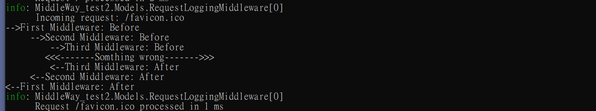

# 概念
- 微軟提出的Middleway 概念圖如下:
- 

我們回歸最基本的程式邏輯，其實它像是傳統的寫法，
```
public class TraditionalFlow
{
    public void ProcessRequest(string request)
    {
        // Step 1: 驗證請求
        if (ValidateRequest(request))
        {
            Console.WriteLine("Step 1: 驗證請求 - 通過");

            // Step 2: 進行處理
            if (ProcessRequestData(request))
            {
                Console.WriteLine("Step 2: 進行處理 - 成功");

                // Step 3: 回傳結果
                if (ReturnResult(request))
                {
                    Console.WriteLine("Step 3: 回傳結果 - 成功");
                }
                else
                {
                    Console.WriteLine("Step 3: 回傳結果 - 失敗");
                }
            }
            else
            {
                Console.WriteLine("Step 2: 進行處理 - 失敗");
            }
        }
        else
        {
            Console.WriteLine("Step 1: 驗證請求 - 失敗");
        }
    }

    private bool ValidateRequest(string request)
    {
        // 模擬驗證邏輯
        return !string.IsNullOrEmpty(request);
    }

    private bool ProcessRequestData(string request)
    {
        // 模擬處理邏輯
        return request.Length > 5;
    }

    private bool ReturnResult(string request)
    {
        // 模擬結果回傳邏輯
        return true;
    }
}

```
或是像這樣的架構:
```
public class ExceptionFlow
{
    public void ProcessRequest(string request)
    {
        try
        {
            // Step 1: 驗證請求
            ValidateRequest(request);
            Console.WriteLine("Step 1: 驗證請求 - 通過");

            // Step 2: 進行處理
            ProcessRequestData(request);
            Console.WriteLine("Step 2: 進行處理 - 成功");

            // Step 3: 回傳結果
            ReturnResult(request);
            Console.WriteLine("Step 3: 回傳結果 - 成功");
        }
        catch (ValidationException ex)
        {
            Console.WriteLine($"Step 1: 驗證請求 - 失敗: {ex.Message}");
        }
        catch (ProcessingException ex)
        {
            Console.WriteLine($"Step 2: 進行處理 - 失敗: {ex.Message}");
        }
        catch (ResultException ex)
        {
            Console.WriteLine($"Step 3: 回傳結果 - 失敗: {ex.Message}");
        }
    }

    private void ValidateRequest(string request)
    {
        if (string.IsNullOrEmpty(request))
        {
            throw new ValidationException("請求無效，請求不能為空。");
        }
    }

    private void ProcessRequestData(string request)
    {
        if (request.Length <= 5)
        {
            throw new ProcessingException("處理失敗，請求長度不足。");
        }
    }

    private void ReturnResult(string request)
    {
        if (request != "valid result")
        {
            throw new ResultException("回傳結果失敗，結果無效。");
        }
    }
}

public class ValidationException : Exception
{
    public ValidationException(string message) : base(message) { }
}

public class ProcessingException : Exception
{
    public ProcessingException(string message) : base(message) { }
}

public class ResultException : Exception
{
    public ResultException(string message) : base(message) { }
}
```
[大眾說法]雖然在編譯後的底層邏輯上，Middleway 的 pipeline 和 if-else 或異常處理的邏輯可能是相似的，但 Middleway 提供了一種更為清晰、模組化和可擴展的方式來構建應用程式的邏輯流程。這使得開發和維護變得更簡單，並能在長期運行中提高代碼質量。而且Middleway 的每個步驟可以單獨進行測試，更容易找到和修復問題。
另外一個優點，每個Middleway在執行上可以發揮多執行緒的優勢。

# 本範例
在這支程式中，我們模擬了三個中介層，來觀察上下層程式執行的先後關係。並在第三層中，拋出了一個異常，再catch它，看看會不會炸掉pipe-line。實驗結果，如果有 catch，則會被攔截。若無，則整支程式會終止。

